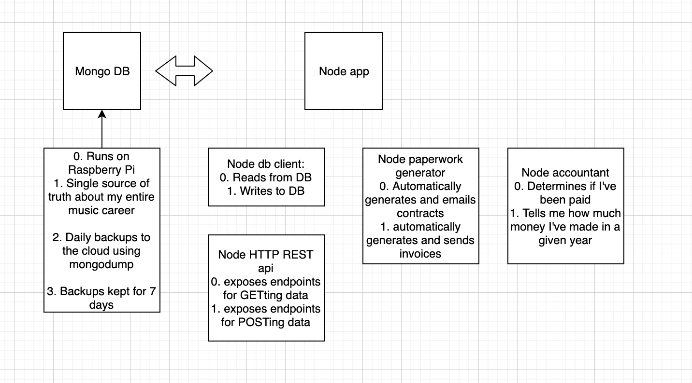

# Leopold
A virtual agent for my violin playing!

This project will answer the following questions:

- Where and when should I be playing the violin?
- Have I been paid for playing the violin?

### Local Dev:

-  Run the Docker stack: `docker-compose up`
   
   This runs the Mongo container as well as the Leopold app (defined in the Dockerfile)
   You can proceed with usual Docker commands, but using `balena` instead of `docker`
      e.g. `balena ps --format "{{.ID}}: {{.Names}}"`

### Dev Deployment:
#### Deploying to dev server
- Find the IP address of your dev Raspberry Pi using Balena's dashboard or CLI
- `balena push [YOUR IP ADDRESS]` 
   
   This pushes all your existing code, regardless of its git status. More info:
   https://www.balena.io/docs/learn/deploy/deployment/
 
#### ssh into dev server
- `balena ssh [YOUR IP ADDRESS]`  
   

### Proposed Technologies:
Monitoring: Prometheus

Database: MongoDB running on a Raspberry Pi with daily backups to the cloud using `mongodup`

CI/CD: Circle CI

Code: 
- Typescript
- Node
- Jest
- Open Api

Dev Server:
Raspberry Pi run with Balena in dev mode (can be same hardware as Mongo container?)

Prod Server:
Raspberry Pi run with Balena in prod mode (can be same hardware as Mongo container?)

### Architecture

### Contributing:

- See Contributing.md
